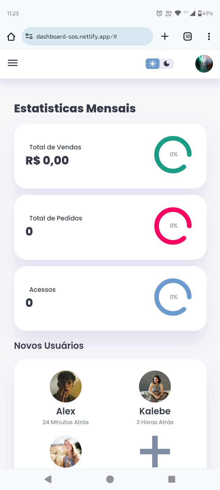

# PROJETO Responsive Dashboard Admin (DESKTOP/MOBILE)

Projeto desenvolvido a partir de uma aula no Youtube, para fins de prática de código.

Tecnologias Usadas:  
• HTML  
• CSS  
• JavaScript

Link: https://dashboard-sos.netlify.app/

### Responsividade Desktop:
 

### Responsividade Mobile:
   

  